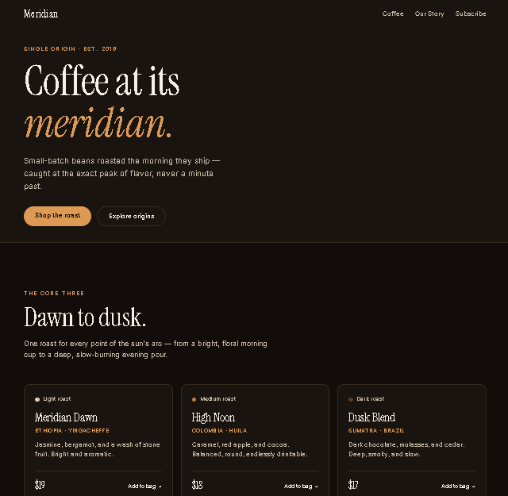

# Meridian Coffee Roasters — Landing Page

A responsive landing page for a fictional single-origin coffee brand, built from scratch with vanilla HTML, CSS, and JavaScript — no frameworks, no build step.

**Live demo → [meridian-landing-mu.vercel.app](https://meridian-landing-mu.vercel.app/)**



---

## The concept

*Meridian* is the sun at its highest point. The whole site runs on that one idea: the headline (*"Coffee at its meridian"*), the product line — **Dawn → High Noon → Dusk**, one roast for each point of the sun's arc — and a warm, dark, coffee-derived palette instead of the usual kraft-paper-and-terracotta coffee-shop look. Name, product, and design all pull in the same direction.

## What it demonstrates

- **Responsive layout, framework-free** — fluid type via `clamp()` and a self-reflowing card grid via `grid-template-columns: repeat(auto-fit, minmax(260px, 1fr))`. The layout adapts from three columns down to one purely from the CSS, with no media-query sprawl.
- **A small design system** — every color and typeface decision lives in CSS custom properties (`--espresso`, `--crema`, `--oat`…), defined once and reused across the hero, cards, and footer. Change a token, the whole site moves.
- **Type-led hierarchy** — one expressive display serif (Instrument Serif) against a quiet sans (Inter); personality concentrated in the headline so the page reads as intentional.
- **A consistent interaction language** — buttons and cards share one hover vocabulary (lift + amber accent), so the page feels designed rather than assembled.
- **Semantic, accessible markup** — real `header` / `main` / `section` / `footer` structure, `prefers-reduced-motion` support, keyboard-friendly links.
- **Deployed on Vercel** with automatic redeploys on every push to `main`.

## Built with

HTML5 · CSS3 (custom properties, Grid, Flexbox, `clamp()`) · Vanilla JavaScript · Google Fonts · Vercel

---

## Case study

**Problem** — Coffee brands online tend to look identical: kraft paper, beige, terracotta. The goal was a landing page that feels like a genuine premium roaster and stands apart from that template — while proving clean, responsive front-end fundamentals with no framework leaning on me.

**Build** — I designed a single-origin brand, *Meridian*, around one idea: coffee caught at its peak. The build is vanilla HTML/CSS/JS with a CSS-custom-property design system, `clamp()` fluid type, and an `auto-fit` grid so the layout is fully responsive without a stack of breakpoints. The palette is derived from roasted coffee itself; a single display serif carries the personality; and buttons and cards share one hover language for cohesion.

**Result** — A polished, fully responsive one-pager, deployed to Vercel with push-to-deploy wired up. The layout reflows cleanly from widescreen to phone from the CSS alone, and every commit to `main` ships to the live URL automatically.

---

## Run locally

No dependencies and no build step. Clone the repo and open `index.html` directly, or serve it with the VS Code **Live Server** extension:

```bash
git clone https://github.com/samchill93/meridian-landing.git
cd meridian-landing
# then open index.html, or right-click → "Open with Live Server"
```
